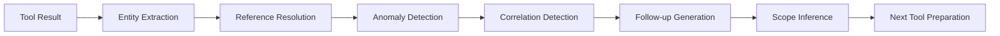
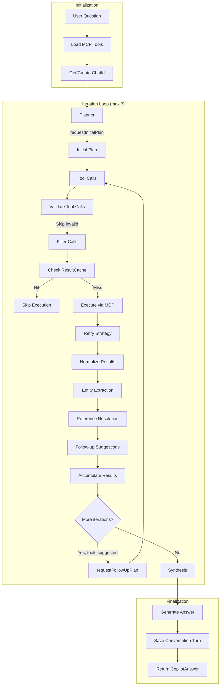

# OpsOrch Copilot Design

Purpose: define how Copilot answers OpsOrch operational questions using only `opsorch-mcp` tools and an LLM that plans, calls tools, and synthesizes results.

## Goals
- Use MCP tools (no direct Core calls) to gather incidents, timelines, tickets, alerts, logs, metrics, and services.
- Support the common questions catalog (summaries, severity triggers, similar incidents, deploy correlation, logs/metrics drill, causal hints).
- Provide capability-specific handlers for entity extraction, intent classification, follow-up suggestions, scope inference, and validation.
- Keep answers short, with evidence (IDs, time ranges, trends) and uncertainty when data is missing.

## Boundaries
- UI: `opsorch-console`
- Copilot runtime: this repo (LLM prompts + capability handlers + tool orchestration)
- Tools: `opsorch-mcp` via stdio or HTTP `http://localhost:7070/mcp`
- Source of truth: `opsorch-core`

## Capability-Based Handler Architecture

OpsOrch Copilot is structured around six core capabilities, each with specialized handlers:

### Capabilities
1. **Incident**: Query and analyze incidents, timelines, and status changes
2. **Alert**: Monitor and investigate active alerts and detectors
3. **Log**: Search and analyze logs for error patterns and diagnostics
4. **Metric**: Query and correlate metrics for performance analysis
5. **Service**: Discover services and their dependencies
6. **Ticket**: Link incidents to support and change tickets

### Handler Types (per capability)

Capabilities implement specialized handlers from this set (11 types total):

| Handler Type | Purpose | Key Registries |
|-------------|----------|----------------|
| **Intent** | Classifies user intent and detects keywords | `IntentRegistry` |
| **Entity** | Extracts structured entities (IDs, references) from tool results | `EntityRegistry` |
| **Follow-up** | Suggests relevant follow-up tool calls based on results | `FollowUpRegistry` |
| **Validation** | Validates and normalizes tool call arguments | `ValidationRegistry` |
| **Scope** | Infers query scope (service, environment, team) from context | `ScopeRegistry`, `ScopeInferenceRegistry` |
| **Reference** | Resolves pronouns like "that incident" to specific entity values | `ReferenceRegistry` |
| **Correlation** | Detects correlations between events (incidents, logs, metrics) | `CorrelationRegistry` |
| **Anomaly** | Detects anomalies in metric time series data | `AnomalyRegistry` |
| **QueryBuilder** | Constructs tool-specific queries from natural language | `QueryBuilderRegistry` |
| **ServiceDiscovery** | Discovers available services from MCP | `ServiceDiscoveryRegistry` |
| **ServiceMatching** | Performs fuzzy matching of service names in questions | `ServiceMatchingRegistry` |

### Handler Flow



1. **Entity Extraction**: Capability-specific entity handlers extract relevant entities (IDs, timestamps, service names)
2. **Reference Resolution**: Resolves references like "that incident" to specific entity values using conversation history
3. **Anomaly Detection**: Metric handlers detect statistical anomalies in time series data
4. **Correlation Detection**: Cross-domain handlers detect correlations between events
5. **Follow-up Generation**: Follow-up handlers suggest intelligent next actions based on tool results
6. **Scope Inference**: Scope handlers infer query scope for subsequent tool calls

### Registries

All handlers are registered in `capabilityRegistry.ts` with 12 registry types:

```mermaid
classDiagram
    class FollowUpRegistry {
        +register(toolName, handler)
        +execute(context, toolResult) ToolCall[]
    }
    class EntityRegistry {
        +register(toolName, handler)
        +execute(context, toolResult) Entity[]
    }
    class ReferenceRegistry {
        +register(entityType, handler)
        +execute(context, entityType, text) string
    }
    class ValidationRegistry {
        +register(toolName, handler)
        +execute(context, toolName, args) ValidationResult
    }
    class IntentRegistry {
        +register(handler)
        +execute(context) IntentResult
    }
    class ScopeInferenceRegistry {
        +register(capability, handler)
        +execute(context) QueryScope
    }
    class CorrelationRegistry {
        +register(eventType, handler)
        +execute(context, events) Correlation[]
    }
    class AnomalyRegistry {
        +register(capability, handler)
        +execute(context, capability, series) Anomaly[]
    }
    class QueryBuilderRegistry {
        +register(toolName, handler)
        +execute(context, toolName, nl) JsonObject
    }
    class ServiceDiscoveryRegistry {
        +register(handler)
        +execute(context) string[]
    }
    class ServiceMatchingRegistry {
        +register(handler)
        +execute(context, question, services) string
    }
```



## CopilotEngine Orchestration

The `CopilotEngine` class in `copilotEngine.ts` orchestrates the end-to-end flow of answering operational questions:



### Engine Flow Details

1. **Initialization**
   - Load available MCP tools via `tools/list` (cached per session)
   - Generate or retrieve `chatId` for conversation tracking
   - Filter out internal diagnostic tools (e.g., `health`)

2. **Planning Phase** (`planner.ts`)
   - `requestInitialPlan()` - LLM plans initial tool calls with arguments
   - If LLM doesn't return tool calls, falls back to `requestJsonPlan()`
   - If JSON planning fails, uses `inferPlanFromQuestion()` heuristic fallback
   - Tool calls limited to 3 per planning request

3. **Tool Execution Loop** (max 3 iterations)
   - **Validation**: Check required fields, skip calls with placeholder args `{{...}}`
   - **Caching**: `ResultCache` prevents duplicate calls within the same turn
   - **Execution**: `runToolCalls()` with retry strategy (exponential backoff)
   - **Normalization**: `toolResultNormalizer.ts` standardizes result structures
   - **Time Window Expansion**: If results are empty, automatically expands query windows

4. **Handler Processing** (per tool result)
   - **Entity Extraction**: Extract IDs, timestamps, service names
   - **Reference Resolution**: Resolve "that incident" → `INC-123`
   - **Follow-up Generation**: Suggest next tools based on results
   - **Scope Inference**: Infer service/environment for subsequent queries

5. **Refinement** (if more tools needed)
   - `requestFollowUpPlan()` with accumulated results
   - LLM decides whether to call more tools or synthesize answer
   - Loop continues until: no more tools suggested, or max iterations reached

6. **Synthesis** (`synthesis.ts`)
   - LLM generates final answer with all accumulated evidence
   - Answer includes: conclusion, evidence, references, missing data notes
   - Conversation turn saved for multi-turn support

### Key Configuration

| Parameter | Default | Description |
|-----------|---------|-------------|
| `maxIterations` | 3 | Maximum tool execution loops |
| `MAX_TOOL_CALLS_PER_ITERATION` | 5 | Tool calls per iteration |
| `MAX_PLANNER_CALLS` | 3 | Tool calls per planning request |

## Tool usage patterns
- Incidents: `query-incidents` (filter by severity/recency/service) → per incident `get-incident` + `get-incident-timeline` to find severity changes, deploy notes, IDs (PagerDuty/Jira IDs in fields/metadata/body).
- Tickets: `query-tickets` (by incident/service keywords); `get-ticket` if needed for details.
- Alerts: `query-alerts` for detector or paging context; `get-alert` if exposed via MCP in the future.
- Services: `query-services`/`list-services` to identify dependencies and similar services for related incidents.
- Logs: `query-logs` with service scope and time windows (incident window and pre/post). Focused queries for 500s/error patterns; compare counts and top patterns when possible.
- Metrics: `query-metrics` for latency (p95/p99), CPU, memory, RPS. Compare aligned windows to test correlations and find anomalies.
- Providers: `list-providers` only to report capability availability.

## Reasoning recipes (mapped to user questions)
- Summarize incident: get incident + timeline; note start time, severity, current status, latest key events.
- Trigger for severity escalation: scan timeline for severity change; cite event immediately before/at change (deploy, SLO breach, alert).
- Similar incidents for a service: `query-incidents` scoped by service/severity/time; match titles/body/metadata tokens; list top matches.
- Deploy correlation: find deploy notes in timeline; compare metrics/logs before vs after deploy (±15–30m); highlight co-moving metrics.
- p95/p99 latency vs CPU/memory/traffic: fetch latency, CPU, memory, RPS series over same window; note whether peaks align.
- “Last N minutes of logs”: `query-logs` with window and service scope; return dominant patterns and counts.
- Error signature match: compare current error substrings to recent incidents (query by keyword) and timelines.
- Pod/node hotspot: if metrics/logs include per-instance labels, aggregate to find max contributors (CPU/errors) and report top offenders.
- Correlate logs + metrics: fetch both over same window; align timestamps; note earliest divergence and strongest correlation.

## Answer format
- Short conclusion up front.
- Evidence: incident IDs, severity/status, timestamps, key timeline events, metric/log highlights, ticket IDs, alert IDs.
- References object (instead of raw links): incidents[], metrics[{expression,start/end/step}], logs[{query,start/end,service}], tickets[], alerts[], services[]. Console turns these into clickable deep links.
- Note gaps (e.g., missing provider data) and suggest the next query only when necessary.

## Configuration
- MCP endpoint: `http://localhost:7070/mcp` or stdio spawn of `opsorch-mcp`.
- Core URL/token/timeouts set on the MCP server (env: `OPSORCH_CORE_URL`, `OPSORCH_CORE_TOKEN`).
- LLM backend: configurable (OpenAI/Anthropic/local); runtime standardizes chat + tool-call schema.

## Implementation status

### ✅ Completed
- **MCP Client abstraction**: `McpClient` interface with `OpsOrchMcp` HTTP implementation and `MockMcp` for testing
- **Multi-step agentic reasoning loop**: Configurable `maxIterations` for complex problem solving with iteration limits
- **Capability-based handler architecture**: Domain-specific handlers for all 6 core capabilities with 11 handler types
- **12 Registry Types**: Intent, Entity, FollowUp, Reference, Validation, Scope, ScopeInference, Correlation, Anomaly, QueryBuilder, ServiceDiscovery, ServiceMatching
- **Entity extraction system**: Capability-specific entity handlers extract IDs, timestamps, and references from tool results
- **Intent classification**: Per-capability intent handlers for accurate query understanding
- **Follow-up suggestion engine**: Context-aware follow-up tool recommendations based on tool results and conversation history
- **Reference resolution**: Resolves pronouns and references (e.g., "that incident") to specific entities using conversation context
- **Scope inference**: Automatic scope detection (service, environment, team) for intelligent tool parameterization with confidence weighting
- **Validation system**: Per-capability handlers validate tool calls and normalize arguments
- **Correlation detection**: Cross-domain correlation handlers for incidents, logs, and metrics
- **Anomaly detection**: Statistical anomaly detection in metric time series data
- **Query building**: Natural language to structured query conversion for logs and metrics
- **Conversation management**: Persistent conversation history with LRU eviction and multi-turn support
- **Result caching**: Prevents duplicate tool calls within a conversation turn
- **Context-aware synthesis**: LLM-based answer generation with capability-specific evidence extraction
- **Parallel tool execution**: Concurrent tool call execution for performance optimization
- **Service discovery**: Cached service lookup with fuzzy matching for intelligent pattern matching
- **Execution tracing**: Full diagnostics of the reasoning and tool execution process
- **Resilience**: Retry strategy with exponential backoff, jitter, and circuit breaker pattern
- **Context management**: Token budget estimation with priority-based truncation
- **Timeline summarization**: Condenses long incident timelines to key events
- **Time window expansion**: Automatic window expansion when queries return empty results
- **Plan fallback**: Heuristic-based fallback when LLM planning fails

## Resilience

Copilot implements robust error handling via `retryStrategy.ts`:

- **Exponential backoff**: Delays increase exponentially between retries
- **Jitter**: Random variation prevents thundering herd
- **Circuit breaker**: Opens after repeated failures, preventing cascading failures
- **Transient error detection**: Distinguishes retryable errors (rate limits, network) from permanent failures

## Context Management

`contextManager.ts` handles LLM context window limits:

- **Token estimation**: 1 token ≈ 4 characters heuristic
- **Priority-based truncation**: System > Recent > Older messages
- **Result condensation**: Condenses tool results to fit token budgets
- **Smart summarization**: Summarizes old context when approaching limits

## Testing

### Unit Tests
Tests use `MockMcp` from `src/mcps/mock.ts` to simulate MCP tool responses without network calls:

```typescript
const mockMcp = new MockMcp(
  async () => [{ name: 'query-incidents' }, { name: 'query-logs' }],
  async (call) => ({ name: call.name, result: { mock: 'data' } })
);
```

Comprehensive test suites cover:

**Engine & Orchestration:**
- **CopilotEngine**: Planning loop, iteration limits, multi-turn conversations, cache behavior
- **EntityExtractor**: Entity extraction from various tool result structures
- **ReferenceResolver**: Reference resolution with conversation history, pronoun disambiguation
- **FollowUpEngine**: Follow-up suggestion generation and deduplication
- **ExecutionTracer**: Trace creation, telemetry, and diagnostics

**Capability Handlers:**
- **Intent Classification**: Pattern matching, service extraction, tool injection
- **Entity Extraction**: ID extraction, entity type detection, nested structure handling
- **Scope Inference**: Scope detection from context, intelligent parameterization
- **Reference Handlers**: Pronoun resolution, entity linking, temporal references

**Conversation Management:**
- **ConversationManager**: Turn storage, retrieval, LRU eviction
- **ConversationStore**: In-memory and SQLite persistence
- **ConversationSearch**: Full-text search, filtering, result ranking

**Tool Execution:**
- **ToolRunner**: Tool call execution, result normalization, error handling
- **ParallelToolRunner**: Concurrent execution, ordering, deduplication
- **ResultCache**: Cache hits/misses, invalidation

**Analysis & Synthesis:**
- **CorrelationDetector**: Correlation detection, root cause identification
- **AnomalyDetector**: Anomaly detection, trend analysis
- **TimeWindowExpander**: Window expansion, capping calculations
- **AnswerFormatter**: Evidence aggregation, reference formatting

**Utilities:**
- **ChatNamer**: Conversation name generation and synthesis
- **ServiceDiscovery**: Service lookup and caching
- **TimestampUtils**: Timestamp parsing and formatting
- **MetricUtils**: Metric parsing and aggregation
- **ToolsSchema**: Tool schema validation

Run all tests: `npm test`

### Integration Testing
Start the full stack for end-to-end testing:
1. Start Core: `cd ../opsorch-core && npm run dev`
2. Start MCP: `cd ../opsorch-mcp && npm run dev`
3. Start Copilot: `npm run dev`
4. Start Console: `cd ../opsorch-console && npm run dev`

Test via Console UI or direct API calls to `http://localhost:6060/chat`

### Test Organization
Tests are organized by component:
- `tests/` – Main test directory
- `tests/engine/` – Engine-specific tests
- Test file naming: `<component>.test.ts` corresponds to `src/<path>/<component>.ts`
