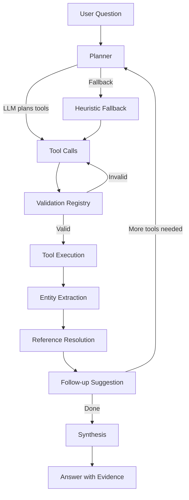

# OpsOrch Copilot

OpsOrch Copilot is the AI runtime for OpsOrch. It plans tool calls against `opsorch-mcp`, gathers evidence, and returns structured answers for the Console UI and other clients.

Copilot never talks to OpsOrch Core directly. It only uses the MCP tools layer.

## Status

- License: Apache-2.0
- Runtime: Node.js 20+
- Transport: HTTP API
- LLM providers: `mock`, `openai`, `anthropic`, `gemini`

## Quick Start

1. Start `opsorch-core`
2. Start `opsorch-mcp`
3. Start Copilot

```bash
cd opsorch-copilot
npm install
MCP_URL=http://localhost:7070/mcp \
LLM_PROVIDER=mock \
npm run dev
```

Health check:

```bash
curl http://localhost:6060/health
```

Chat request:

```bash
curl http://localhost:6060/chat \
  -H 'Content-Type: application/json' \
  -d '{"message":"What incidents are active right now?"}'
```

## Configuration

Core runtime settings:

- `PORT` - HTTP port for the Copilot API. Default: `6060`
- `MCP_URL` - MCP endpoint URL. Default: `http://localhost:7070/mcp`
- `LLM_PROVIDER` - `mock`, `openai`, `anthropic`, or `gemini`. Default: `mock`

Provider-specific settings:

- `OPENAI_API_KEY` with optional `OPENAI_MODEL` and `OPENAI_BASE_URL`
- `ANTHROPIC_API_KEY` with optional `ANTHROPIC_MODEL` and `ANTHROPIC_BASE_URL`
- `GEMINI_API_KEY` with optional `GEMINI_MODEL`

Conversation storage:

- `CONVERSATION_STORE_TYPE` - `memory` or `sqlite`. Default: `memory`
- `SQLITE_DB_PATH` - SQLite DB path when using `sqlite`. Default: `./data/conversations.db`

## What Copilot should do

- Retrieve recent/impactful incidents, surface their context, and include related PagerDuty alerts, linked Jira tickets, and nearby logs/metrics.
- Explain incident history and changes, e.g., "What was the trigger for the severity escalation?" by inspecting timelines and metadata.
- Find patterns, e.g., "Has this service had similar incidents recently?" by querying incidents filtered by service/time/severity.
- Correlate signals, e.g., "Is the spike in p95 latency correlated with CPU, memory, or traffic?" by querying metrics over the same window and comparing trends.
- Use messaging tools to share findings or timelines when needed.

## Question coverage (examples)

- Basic understanding: summarize an incident; note changes right before start; infer likely root cause from logs/metrics; correlate with deploys; pull last N minutes of related logs.
- Context & relationships: list dependent services; find similar incidents for a service; relate to earlier incidents; identify severity escalation triggers.
- Causal analysis: match error signatures to past incidents; correlate latency spikes with CPU/memory/traffic; distinguish DB vs network vs code issues; compare against prior checkout failures.
- Metrics: explain CPU spikes and latency anomalies; surface metric anomalies for a service in a window; identify pods/nodes contributing most errors.
- Logs: query 500s for a service over a window; extract dominant/error patterns; list IPs with most failed requests; flag unusual log patterns.
- Correlation: align logs and metrics for a service; test hypotheses like memory leaks; find earliest signals of degradation.

## Stack and boundaries

- UI: `opsorch-console`
- Copilot runtime: this repo (LLM prompts, reasoning, tool selection loops)
- Tools: `opsorch-mcp` (typed MCP tools around OpsOrch Core)
- Source of truth: `opsorch-core` (incidents, logs, metrics, services, tickets, messaging)

## Development notes

- MCP dev server default: `http://localhost:7070/mcp`
- Copilot communicates only via MCP tools; no direct Core calls.
- See `AGENTS.md` for the layered architecture overview.
- See `DESIGN.md` for capability-handler details.

Core implementation areas:

- `src/engine/` - planning, execution, follow-ups, references, synthesis
- `src/llms/` - LLM provider adapters
- `src/mcps/` - MCP client implementations
- `src/stores/` - in-memory and SQLite conversation stores
- `src/server.ts` - HTTP API

### Capability-Based Handler Architecture

Copilot uses a capability-based handler system organized around six core operational domains:

**Six Core Capabilities:**
- `incident/` – Incident query and analysis
- `alert/` – Alert monitoring and investigation
- `log/` – Log search and analysis
- `metric/` – Metrics query and correlation
- `service/` – Service discovery and dependencies
- `ticket/` – Ticket linking and management

**Handler Types (11 total):**
Each capability implements specialized handlers from this set:

| Handler Type | Purpose |
|-------------|----------|
| **Intent** | Classifies user intent for the capability |
| **Entity** | Extracts structured entities (IDs, timestamps) from tool results |
| **Follow-up** | Suggests intelligent next actions based on results |
| **Validation** | Validates tool call arguments and normalizes them |
| **Scope** | Infers query scope (service, environment, team) from context |
| **Reference** | Resolves pronouns like "that incident" to specific entity IDs |
| **Correlation** | Detects correlations between events (incidents, logs, metrics) |
| **Anomaly** | Detects anomalies in metric time series data |
| **QueryBuilder** | Constructs tool-specific queries from natural language |
| **ServiceDiscovery** | Discovers available services from MCP |
| **ServiceMatching** | Performs fuzzy matching of service names in questions |

**Engine Flow:**



All handlers are registered in `capabilityRegistry.ts` and invoked by the engine during tool execution.

### HTTP API (console/CLI integration)

- Start server: `npm start` (env: `PORT` default 6060, `MCP_URL` default `http://localhost:7070/mcp`).
- `POST /chat` – body `{ "message": "<question>", "chatId?": "<reuse-id>" }`
  - Response: `{ "chatId": "<id>", "answer": { conclusion, evidence?, missing?, references?, chatId? } }`
  - `answer.references` drives Console deep links and includes buckets for `incidents[]`, `services[]`, `tickets[]`, `alerts[]`, plus structured `metrics[]`/`logs[]` entries (each with expression + window)
  - If `chatId` is not provided, the response includes one so callers can persist and reuse it.
- `GET /health` – liveness check: `{ "status": "ok" }`
- `GET /chats` – list saved conversations with previews and pagination
- `GET /chats/search?query=...` – search saved conversations
- `GET /chats/:id` – retrieve a single saved conversation

### Conversation Storage

Copilot supports two storage backends for conversation persistence:

#### In-Memory Storage (Default)
- Conversations are stored in memory with LRU eviction
- Data is lost on server restart
- No configuration required

#### SQLite Storage
- Conversations persist across server restarts
- Stored in a local SQLite database file
- Maintains the same LRU eviction behavior as in-memory storage

**Configuration:**

Set the following environment variables to enable SQLite storage:

```bash
# Enable SQLite storage
CONVERSATION_STORE_TYPE=sqlite

# Optional: specify database file path (default: ./data/conversations.db)
SQLITE_DB_PATH=/path/to/conversations.db
```

Docker example:

```yaml
services:
  copilot:
    image: opsorch-copilot:latest
    environment:
      - CONVERSATION_STORE_TYPE=sqlite
      - SQLITE_DB_PATH=/data/conversations.db
    volumes:
      - copilot-data:/data
volumes:
  copilot-data:
```

Backup and recovery:

For SQLite storage, regular backups of the database file are recommended:

```bash
# Backup
cp /path/to/conversations.db /path/to/backup/conversations-$(date +%Y%m%d).db

# Restore
cp /path/to/backup/conversations-20250122.db /path/to/conversations.db
```

## Testing

```bash
npm test
npm run type-check
```

Coverage includes:

- planner and tool execution loops
- conversation history and storage backends
- MCP integration layers
- capability handlers and follow-ups
- HTTP API behavior

### Integration Testing
Start the full stack for end-to-end testing:
1. Start Core: `cd ../opsorch-core && go run ./cmd/opsorch`
2. Start MCP: `cd ../opsorch-mcp && npm run dev`
3. Start Copilot: `npm run dev`
4. Start Console: `cd ../opsorch-console && npm run dev`

Test via Console UI or direct API calls to `http://localhost:6060/chat`

### Testing Patterns
- **MockMcp**: Simulates MCP tool responses without network calls
- **Temporary SQLite databases**: Each SQLite test uses a temporary database file cleaned up after test runs
- **Conversation fixtures**: Pre-built conversation data for testing multi-turn flows
- **Tool result mocking**: Realistic tool responses for testing handlers and synthesis

## Seeding the Database

To populate the database with realistic sample conversations for testing or demo purposes:

```bash
npm run seed
```

This will:
- Clear any existing conversations in the database
- Generate 30 realistic operational conversations covering various scenarios:
  - Incident investigations (high error rates, service outages)
  - Service health checks and monitoring
  - Performance issues (latency spikes, memory leaks)
  - Database and infrastructure problems
  - Deployment verifications
  - SSL certificate management
  - Rate limiting and cache issues
- Populate conversations with realistic tool results, timestamps, and entities
- Distribute conversations across the last 30 days

The seed script uses the database path from `SQLITE_DB_PATH` environment variable or defaults to `./data/conversations.db`.

## License

Apache-2.0. See [LICENSE](LICENSE).
